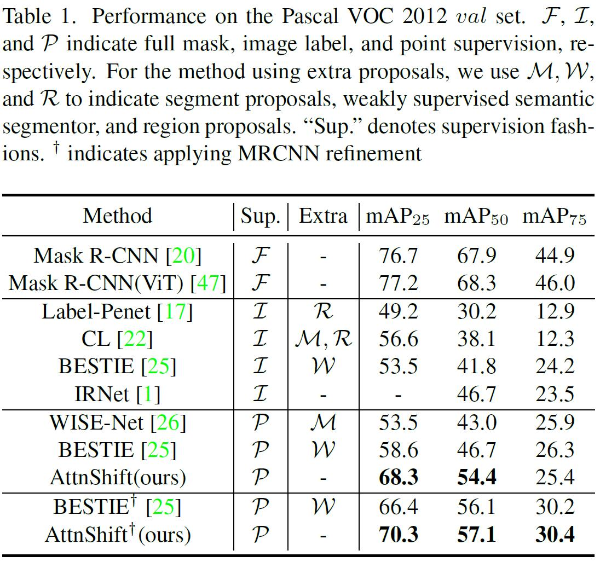

# AttentionShift


## Performance on Pascal VOC and MS-COCO:
 | 
---|---


# MAE pretrained link
```
wget https://dl.fbaipublicfiles.com/mae/pretrain/mae_pretrain_vit_base.pth
```

### Installation

Just run the install.sh

### Training

To train AttentionShift, run:
Just run run_train.py

The annotations can be obtained [here](https://mailsucaseducn-my.sharepoint.com/:u:/g/personal/liaomingxiang20_mails_ucas_edu_cn/ERZxeMHpV2ZMks-0RHvSbTIBT7Haex-Gjm9eDvuz7d7QAw?e=J1Egvp)

**Note:** `use_checkpoint` is used to save GPU memory. Please refer to [this page](https://pytorch.org/docs/stable/checkpoint.html) for more details.


### Apex:
We use apex for mixed precision training by default. To install apex, run:
```
git clone https://github.com/NVIDIA/apex
cd apex
pip install -v --disable-pip-version-check --no-cache-dir --global-option="--cpp_ext" --global-option="--cuda_ext" ./
```
If you would like to disable apex, modify the type of runner as `EpochBasedRunner` and comment out the following code block in the [configuration files](configs/swin):
```
# do not use mmdet version fp16
fp16 = None
optimizer_config = dict(
    type="DistOptimizerHook",
    update_interval=1,
    grad_clip=None,
    coalesce=True,
    bucket_size_mb=-1,
    use_fp16=True,
)
```

